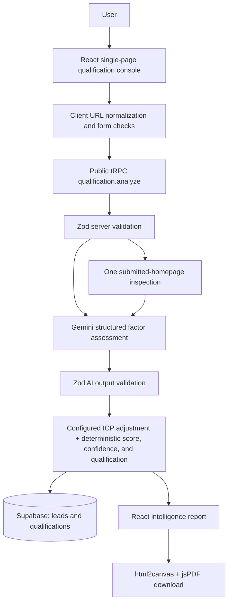

# SEOSignal — Technical & Assessment Documentation

> **Documentation basis.** This document reverse-engineers the implemented repository as of the documentation commit. The application code, production schema file, deployed Supabase REST field projections, and deterministic test suite are the source of truth. No application functionality was changed to create this document.

## 1. Executive overview

**SEOSignal** is an AI-assisted inbound SEO lead-qualification application for an SEO agency or sales team. It converts a submitted lead brief into an evidence-led assessment report rather than acting as a conversational assistant. A user provides a company, website, selected SEO service, monthly budget and currency, and business goal; they can optionally add market, timeline, and current SEO-challenge context. The system produces a 0–100 framework score, `HIGH`/`MEDIUM`/`LOW` qualification, factor evidence, missing-information prompts, a recommended next action, a persisted record, and a downloadable PDF report. [1] [2]

The implemented journey is:

```text
Lead information
  → client website normalization and validation
  → server input validation
  → submitted-homepage inspection
  → Gemini factor assessment
  → deterministic ICP adjustment, score, and qualification
  → missing-information and confidence assembly
  → Supabase lead + qualification persistence
  → rendered intelligence report
  → client-side PDF download
```

AI is used to turn bounded lead and homepage evidence into structured factor ratings, reasons, missing-information suggestions, and an operational next step. The application—not Gemini—calculates the returned score and qualification from its explicit factor weights, rating values, thresholds, and disqualifier caps. This makes SEOSignal a **qualification decision-support tool**, not a generic chatbot or a claim that a lead will convert. [3] [4]

## 2. The actual business problem

Inbound SEO leads are heterogeneous: a high budget alone does not establish whether the requested service is supported, whether the company resembles the prototype ICP, whether its objective is appropriate for SEO work, or whether the information is sufficiently clear to scope the opportunity. SEOSignal therefore prioritizes multiple signals rather than presenting budget as a standalone decision.

Service fit matters because the supported-service list is finite. Intent, business objective, use case, timing, target-market context, and information completeness matter because they shape the evidence available for a sales conversation. Missing information is surfaced as follow-up work, not automatically treated as a rejection. The report itself explicitly states that it is **not a conversion-probability model** and that production calibration would require historical CRM and conversion data. [3] [4]

## 3. Core assessment logic

The implemented assessment can be represented as:

```text
Submitted lead + lightweight homepage evidence
  → Gemini factor ratings and evidence
  → configured ICP correction
  → deterministic weighted score + applicable caps
  → HIGH / MEDIUM / LOW qualification
```

Gemini returns a structured assessment containing ten factor ratings, factor reasons, reasoning, missing-information items, and a next-best action. Its schema also includes `score`, `qualification`, and `confidence`, but those three Gemini fields are **not used as the authoritative returned result**. The server recomputes the final score and qualification from the returned factor ratings after applying its own configured logic. Confidence is also computed by the server from the count of `UNKNOWN` factors and the inspection status. [3] [4]

## 4. Input variables

| Variable | Meaning and qualification relevance | Required and validation | Storage |
| --- | --- | --- | --- |
| `company` | Identifies the prospective customer; contributes to Gemini assessment and configured ICP evidence screening. | Required. Server: 2–120 characters. | `leads.company_name` |
| `website` | Public site submitted for lightweight inspection and contextual evidence. | Required. Client accepts a bare domain by prepending `https://`; server requires a URL, at most 500 characters, using HTTP(S). | `leads.website` |
| `serviceRequired` | SEO service requested; used for service-fit assessment and supported-service disqualification logic. | Required enum: SEO strategy, Technical SEO, Content SEO, Enterprise SEO, SEO audit. | `leads.service` |
| `budgetAmount` | Declared monthly commercial scope; assessed against a selected-currency prototype minimum. | Required positive number; server maximum is 1,000,000,000. | `leads.budget_amount` (`numeric(14,2)`) |
| `budgetCurrency` | Currency context for the amount and minimum-threshold comparison. | Required enum of 10 supported currencies. | `leads.budget_currency` |
| `businessGoal` | Intended business outcome; used for business-objective fit and Gemini context. | Required enum: Qualified leads, Organic revenue, Market visibility, Technical health. | `leads.goal` |
| `targetMarket` | Optional geography/market context; may influence geographic fit and is added to missing-information output when absent. | Optional, maximum 160 characters. | `leads.target_market` |
| `timeline` | Optional decision or expected-results horizon; can influence timeline fit and can trigger a short-timeline cap. | Optional, maximum 160 characters. The UI offers 0–30 days, 30–90 days, and 3–6 months. | `leads.timeline` |
| `seoChallenge` | Optional description of the current SEO situation; used as Gemini context. | Optional, maximum 1,000 characters. | `leads.current_situation` |

The interface initially shows the five primary inputs; target market, timeline, and current challenge are disclosed by **“+ Add more context.”** Client validation prevents a bad website value from calling the mutation and uses a concise inline message. Server validation remains authoritative. [1] [2] [5]

## 5. Qualification variables and signals

The following **configured prototype weights** sum to 100%. Each factor is returned by Gemini as `STRONG`, `MODERATE`, `WEAK`, or `UNKNOWN` with a reason; then the application maps that rating into the deterministic score. [3] [4]

| Factor | Weight | How it is determined | Contribution |
| --- | ---: | --- | --- |
| Service Fit | 20% | Gemini assesses the selected service against supplied evidence; configured service capability is also checked deterministically. | Largest weighted factor. |
| ICP / Company Fit | 15% | Gemini assesses company fit; server scans company, URL, and available homepage text for configured ICP/non-prospect terms. | A `WEAK` ICP rating is treated as a fundamental mismatch cap. |
| Budget Fit | 15% | Gemini assesses commercial context; server separately checks whether budget is below 35% of the selected-currency minimum. | A materially low amount caps the result at 49. |
| Geographic / Market Fit | 10% | Gemini assesses submitted target-market context. | Standard weighted contribution. |
| Business Objective Fit | 10% | Gemini assesses the selected business goal. | Standard weighted contribution. |
| SEO Problem / Use-Case Fit | 10% | Gemini assesses the optional current SEO challenge and other lead context. | Standard weighted contribution. |
| Timeline Fit | 5% | Gemini assesses timing; server also detects an expectation of meaningful results in less than 30 days. | Short timeline can cap the result at 35. |
| Buying Intent | 5% | Gemini-derived evidence from the submitted brief. | Standard weighted contribution. |
| Goal Clarity | 5% | Gemini-derived clarity of the declared objective and context. | Standard weighted contribution. |
| Information Completeness | 5% | Gemini-derived completeness of usable evidence. | Standard weighted contribution. |

The configured target profile is B2B SaaS/technology, professional-services firms with a considered buying journey, and established B2B businesses investing in sustainable organic acquisition. These are **prototype assumptions**, not measured conversion rules. [3]

## 6. Score calculation

The server maps factor ratings to numerical values as follows:

| Rating | Numerical value |
| --- | ---: |
| `STRONG` | 100 |
| `MODERATE` | 65 |
| `WEAK` | 25 |
| `UNKNOWN` | 45 |

For the ten configured factors, the preliminary score is:

```text
weighted score = Σ(rating value × factor weight / 100)
final score = round(clamp(adjusted score, 0, 100))
```

If no hard disqualifier applies, the weighted score is returned. If a materially low budget applies, the score is capped at 49. If unsupported service, unrealistic timeline, or fundamental ICP mismatch applies, the score is capped at 35. Missing primary or optional evidence has **no separate arithmetic penalty**; it can affect the Gemini `information_completeness` rating and other factor ratings, which then affect the weighted score. [3] [4]

## 7. HIGH / MEDIUM / LOW thresholds

| Qualification | Implemented threshold |
| --- | ---: |
| `HIGH` | 75–100 |
| `MEDIUM` | 50–74 |
| `LOW` | 0–49 |

These thresholds are configuration values (`high: 75`, `medium: 50`), not statistically calibrated likelihoods of conversion. A production calibration exercise would need historical lead records, sales acceptance, opportunity and revenue outcomes, conversion rates, closed/won labels, and a monitored feedback loop. [3] [4]

## 8. Hard disqualifiers

The engine defines four deterministic conditions. Three are detected directly from the lead; the fourth is added when the final ICP factor is `WEAK`. [3] [4]

| Rule | Implemented condition | Effect |
| --- | --- | --- |
| Unsupported service | The service is not in the configured supported-service list. The public API enum currently prevents normal UI/API input outside that list. | Score cap of 35. |
| Materially low budget | `budgetAmount < selectedCurrencyMinimum × 0.35`. | Score cap of 49. |
| Unrealistic timeline | The timeline matches the server’s less-than-30-day pattern. | Score cap of 35. |
| Fundamental ICP mismatch | The resulting `icp_fit` factor is `WEAK`. Configured non-prospect terms can force that rating; Gemini can also return it. | Score cap of 35. |

The code labels these messages as prototype commercial and ICP assumptions. They do not establish that a real customer will or will not buy. [3]

## 9. Gemini / AI logic

The server calls Google’s `generateContent` endpoint for the configured model, defaulting to `gemini-3.6-flash`. It sends the full normalized lead object plus the homepage inspection status, title, meta description, and visible-text excerpt. The prompt instructs the model to assess only supplied evidence, never invent facts, exchange rates, or client outcomes, and to use `UNKNOWN` where evidence is unsupported. [3] [6]

**Why Gemini was selected:** the repository establishes Gemini as the implemented provider, but it does not record a comparative vendor-selection decision or benchmark. The defensible implementation claim is therefore that Gemini was selected for its current structured `generateContent` integration, not that it was proven superior to alternatives.

The request uses low temperature (`0.15`), `application/json` response MIME type, and an explicit JSON schema. Zod then parses the returned JSON with enumerated ratings and bounded strings/arrays. Network errors and 429/5xx responses receive one 350 ms retry; the request has a 22-second timeout. A missing key, failed request, empty response, or malformed structured output becomes a `GeminiQualificationError`, which the router turns into the same safe client message used for persistence failures. [4] [6]

> **AI boundary.** Gemini supplies factor-level interpretation, reasoning, missing-information suggestions, and next-best action. The server owns configured ICP adjustment, numerical rating mapping, score calculation, threshold classification, hard-disqualifier caps, and confidence labeling. Gemini’s own schema-level score, qualification, and confidence fields are not used as the final result. [3] [4]

This combination does not eliminate all model variability. It constrains outputs with a schema, bounded prompt, evidence-only instruction, `UNKNOWN` option, and deterministic post-processing; it does not make the analysis statistically validated or factually omniscient.

## 10. Website analysis

When a website is provided, the server inspects **only the submitted URL**. It rejects non-HTTP(S) URLs and common private/local hostnames before fetching. The request uses `redirect: "manual"`, a seven-second timeout, a product user agent, and requires a successful `text/html` response. It does not crawl multiple pages or follow redirects. [2] [7]

From at most the first 100,000 characters of HTML, the implementation extracts a title, meta description, and a stripped visible-text excerpt (maximum 1,600 characters). It uses the meta description or an initial visible-text portion as a short site description. The available inspection fields are passed to Gemini. If any inspection condition fails—including timeout, non-HTML response, inaccessible site, invalid protocol, local/private host, or parsing exception—the application returns only `UNAVAILABLE`; it does not fabricate website metadata. [7]

## 11. Confidence

Confidence is **deterministic**, not a calibrated probability and not Gemini-controlled in the returned report. The server counts non-`UNKNOWN` and `UNKNOWN` factors. It returns `High` when at most two factors are unknown, `Moderate` when three or four are unknown, and `Limited` when five or more are unknown. Its rationale also tells the user whether the homepage inspection was available. On persistence, UI labels are normalized to the database enum: `High → HIGH`, `Moderate → MEDIUM`, `Limited → LOW`. [3] [8]

## 12. Missing information

Gemini can return up to six missing-information strings. The server turns them into report findings and supplements them with explicit target-market and decision-timeline findings when those optional inputs are absent. The visible report shows at most four findings. Missing information therefore guides the salesperson toward investigation rather than rejecting an incomplete lead. It can influence scoring only indirectly through Gemini factor ratings, particularly information completeness. [3] [4]

## 13. Next best action

The recommended next move is generated by Gemini in a structured object containing a title, body, and one to four steps. The server includes it in the report and persists it as JSONB. Qualification answers **how the lead fits the configured framework**; the recommendation answers **what the sales team should do next**. [3] [4] [8]

## 14. Complete user flow

```text
User
  ↓
Single-page landing and qualification console
  ↓
Client company/URL checks; bare domain normalized to HTTPS
  ↓
Public tRPC qualification.analyze mutation
  ↓
Zod server validation
  ↓
One submitted-homepage inspection
  ↓
Gemini structured factor assessment
  ↓
Configured ICP adjustment + deterministic score, confidence, and qualification
  ↓
Lead row then linked qualification row in Supabase
  ↓
Browser intelligence report
  ↓
html2canvas snapshot + jsPDF A4 download
```

## 15. Technology stack

| Technology | Implemented role |
| --- | --- |
| React 19 + TypeScript | Single-page frontend and typed user-interface code. |
| Vite 7 | Client development server and production static build. |
| Tailwind CSS 4 + custom CSS | Visual system, responsive design, and report styling. |
| Radix/shadcn-style UI components | Sheet/mobile navigation and reusable accessible primitives. |
| Express 4 | Server composition and middleware host. |
| tRPC 11 + TanStack React Query | Typed browser-to-server `qualification.analyze` mutation. |
| Zod 4 | Server input validation and Gemini structured-output validation. |
| Google Gemini REST API | Structured factor assessment, evidence, missing information, and next action. |
| Supabase Postgres REST API | Persistence of leads and linked qualification outputs. |
| `html2canvas` + `jspdf` | Client-side report snapshot and PDF generation. |
| Vercel configuration + esbuild bundle step | Static frontend output and bundled catch-all serverless handler. |
| Vitest | Deterministic tests; one live Gemini integration test is opt-in. |
| GitHub | Repository source-control remote. |

The package contains additional template dependencies that are not part of the assessment flow. The table names the meaningful dependencies exercised by the documented implementation. [1] [6] [9] [10]

## 16. Frontend architecture

`client/src/pages/Home.tsx` is the principal application page. It owns `LeadInput` form state, the optional-context toggle, inline website validation state, mutation state, report state, and PDF-export state. The tRPC client is used for the analysis mutation. The analysis UI presents the fixed sequence **Reading the lead → Website → Requirement → Fit → Intent** rather than a generic spinner. A failure shows the safe message “Unable to complete the qualification right now. Please try again.” [1]

The rendered report includes a score dial, confidence label, executive summary, ten-factor signal map and table, missing-information section, next move, methodology, and assumptions. The single page uses a floating desktop navigation and Sheet-based mobile menu, with responsive styling and the same form/report functionality across viewports. [1]

## 17. Backend architecture

`server/app.ts` mounts Express JSON/body middleware, platform OAuth/storage plumbing, and the tRPC router at `/api/trpc`. The assessment endpoint is a **public** tRPC mutation. Its execution order is server input validation, homepage inspection, Gemini-backed qualification, Supabase persistence, and response of the generated report. Dependency and unexpected errors are logged by class/name server-side and are returned as a generic internal-error message, avoiding disclosure of provider details. [2] [11]

Gemini and Supabase credentials are read in server modules from environment variables. Neither `GEMINI_API_KEY` nor `SUPABASE_SERVICE_ROLE_KEY` is exposed through a `VITE_` browser variable or returned by the mutation. The `NEXT_PUBLIC_SUPABASE_URL` name is public-style, but this implementation reads it only in server persistence code; it identifies the endpoint and is not treated as a secret. [4] [8] [12]

## 18. Database architecture

The production schema is PostgreSQL/Supabase, not the template’s unused Drizzle/MySQL feature stub. The deployed REST endpoint accepted zero-row projections of every documented column in both tables with HTTP 200 during this audit. [8] [13]

```text
LEADS
  │ 1 : N
  ▼
QUALIFICATIONS
```

| Table | Columns and types | Relationship and purpose |
| --- | --- | --- |
| `public.leads` | `id uuid` PK (generated), `company_name text`, `website text`, `service text`, `budget_amount numeric(14,2)`, `budget_currency text`, `goal text`, nullable `target_market text`, nullable `timeline text`, nullable `current_situation text`, `website_inspection_status text`, `created_at timestamptz`. | Stores submitted lead/commercial context. Currency is separate from amount. |
| `public.qualifications` | `id uuid` PK (generated), `lead_id uuid`, `qualification text`, `score integer`, `confidence text`, `reasoning text`, `factors jsonb`, `missing_information jsonb`, `next_best_action jsonb`, `model text`, `created_at timestamptz`. | `lead_id` references `leads(id)` with `ON DELETE CASCADE`. Stores generated output. Current submission flow creates one qualification for its new lead, while the schema permits future reassessment history. |

The schema constrains qualification to `HIGH`/`MEDIUM`/`LOW`, score to 0–100, confidence to `HIGH`/`MEDIUM`/`LOW`, currency to the supported codes, and inspection status to `AVAILABLE`/`UNAVAILABLE`. It indexes creation time and qualification lead IDs. In persistence, the `factors` JSONB value is the rendered signal array, while missing information and next-best action are their report structures. If qualification insertion fails after a lead insertion, the server attempts to delete the new lead and preserves the original persistence error. [8] [13]

## 19. Security

| Control | Actual behavior |
| --- | --- |
| Gemini key | `GEMINI_API_KEY` is read on the server immediately before the external request and sent as `x-goog-api-key`. |
| Supabase service role | `SUPABASE_SERVICE_ROLE_KEY` is used only in the server REST client as `apikey` and bearer authorization. |
| Secret storage | The README directs deployment-platform secret controls; no tracked `.env` or `.env.example` file exists in this repository audit. |
| Input validation | Client normalizes/validates URL format; the server uses Zod validation and an HTTP(S) URL refinement. |
| Website-safety boundary | Inspection blocks common local/private hostnames, limits request duration, does not follow redirects, requires HTML, and bounds extracted content. |
| AI-output validation | Gemini output is constrained by a response JSON schema and Zod parsing before downstream scoring. |
| Client boundary | The browser receives only the report. Provider credentials and raw Supabase service-role authorization never appear in client application code. |

This audit confirms that secret files are not tracked; it does not prove that a secret was never exposed outside the repository or in an external provider’s logs. [2] [4] [7] [8] [12]

## 20. Error handling

| Condition | Actual server/client behavior |
| --- | --- |
| Invalid form or missing company | Client stops submission and shows a form-level message. |
| Invalid URL | Client shows an inline/form-level validation message; server independently rejects non-HTTP(S) invalid URLs. |
| Website unavailable | Server returns `UNAVAILABLE` inspection and continues qualification without site evidence. |
| Gemini failure or malformed response | Server throws `GeminiQualificationError`; router returns a generic retry message. |
| Supabase failure | Persistence throws `SupabasePersistenceError`; router returns the same generic retry message. If the qualification insert fails after lead insert, cleanup is attempted. |
| Network/mutation failure | Client catch block shows the generic retry message. |
| PDF generation failure | The export routine uses `try/finally` to reset its busy state but has no dedicated user-visible PDF-error message. An exception therefore is not specially surfaced by this page. |

## 21. PDF report

The browser dynamically imports `html2canvas` and `jspdf` when the user selects **Download report**. It captures the existing report DOM at scale 2, inserts the PNG snapshot into an A4 PDF with 10 mm margins, adds pages while the image exceeds printable height, sets document metadata, and downloads a sanitized company-name filename ending in `-seosignal-report.pdf`. [1]

Because it captures the rendered report, the PDF contains the same report sections and current currency formatting as the web UI: company, website, monthly budget, score, qualification title/rationale, confidence, executive summary, factor table/map, missing information, next action, methodology, and assumptions. It is a visual snapshot rather than a separately generated server PDF.

## 22. Currency logic

The interface supports USD, EUR, GBP, INR, CAD, AUD, SGD, AED, CHF, and JPY. `budgetAmount` and `budgetCurrency` are separate fields through input, AI context, persistence, report display, and PDF export. Formatting uses `Intl.NumberFormat` with a currency-specific locale and rounds display to zero fraction digits. [1] [5] [8]

> **No currency conversion is implemented.** The Gemini prompt explicitly forbids exchange-rate conversion. Budget comparisons use a separate configured prototype minimum for each selected currency; the original amount and currency are retained to avoid ambiguity. [3] [4]

## 23. Design and UX decisions

The implemented UI is a premium, single-page experience: an emerald editorial hero establishes the product purpose, minimal navigation keeps the journey focused on the qualification console, and a large product surface makes the form feel like a purposeful sales instrument rather than a generic chat. System-oriented typography, structured report sections, restrained motion, visible form states, and responsive desktop/mobile navigation support readability and informed outreach. [1] [14]

The report intentionally separates score, evidence, missing signals, and next action. That hierarchy supports the business objective: a salesperson can understand both the framework result and the follow-up work required, instead of treating a single number as a decision.

## 24. Prototype assumptions

| Category | Status | Implemented meaning |
| --- | --- | --- |
| Supported SEO services and objectives | **Prototype assumption / configured fact** | The fixed service and objective enums define the current product scope. |
| Target customer profile and ICP terms | **Prototype assumption** | B2B SaaS/technology, professional services, and established B2B organic-acquisition profile plus configured term lists. |
| Weights, rating values, and thresholds | **Prototype assumption** | Ten weights, rating mapping, and 75/50 thresholds are configured code values. |
| Currency minimums and cap rules | **Prototype assumption** | Per-currency commercial minimums and 35% materially-low rule are configured values. |
| Homepage inspection fields | **Fact** | The code extracts only bounded title, meta description, and visible text from one submitted page when available. |
| Factor reasons, missing information, next action | **AI interpretation** | Gemini provides structured interpretations from submitted lead/homepage evidence. |
| Final score, classification, confidence | **Fact: deterministic implementation** | The application recomputes score/classification and derives confidence from unknown-signal count. |

## 25. Why assumptions are necessary

The implemented report states that it is not a conversion-probability model and that historical CRM and conversion data would be needed for production calibration. Without such empirical outcomes, the system can truthfully say a lead scored against the defined prototype framework, but it cannot truthfully claim an 86% chance of conversion. [3]

A production program could replace or adjust assumptions through labelled historical leads, accepted/rejected outcomes, opportunity and revenue results, segment analysis, monitored calibration, and sales feedback.

## 26. Production-version evolution

The following are **future directions, not implemented features**: CRM integration; historical lead/outcome ingestion; conversion-label modelling; score calibration; outcome and revenue tracking; sales-user feedback; audit logs; prompt/model-version records; monitoring; controlled experiments; and governance for changing weights, thresholds, and ICP criteria. These additions would support empirical validation while retaining the current separation between interpreted evidence and business-rule control.

## 27. Limitations

SEOSignal is bounded by prototype assumptions, not historical calibration. Website inspection is intentionally lightweight and can fail or omit context; it neither crawls a site nor follows redirects. Gemini output can vary despite its schema and prompt constraints. Submitted lead details may be incomplete, and the score is not a probability of conversion. The PDF path is client-side and has no dedicated on-page error presentation if rendering fails. [1] [3] [4] [7]

## 28. How I would explain SEOSignal in a 2-minute interview

“SEOSignal is an inbound SEO lead-qualification prototype for an agency sales workflow. Instead of treating every inquiry equally, it asks for the company, public website, requested SEO service, monthly budget with its original currency, business goal, and optional context such as target market and timeline. The server inspects only the supplied homepage when it is available, then sends that bounded evidence to Gemini for a structured assessment of ten factors.

The important design choice is that Gemini is not trusted to make the final commercial decision. It provides factor ratings, evidence, missing-information prompts, and a recommended next step. The application maps those ratings to numeric values, applies explicit weights, configured thresholds, ICP checks, and hard-disqualifier caps, and then computes the HIGH, MEDIUM, or LOW result itself. It also derives confidence from how many signals remain unknown.

The submitted lead and generated qualification are stored separately in Supabase, so the business context is distinct from the assessment output. The user sees a structured report and can download the same rendered report as a PDF. The limitation is that the weights and thresholds are prototype assumptions, not conversion probabilities. To make it production-grade, I would connect CRM outcomes, calibrate the model on historical data, add monitoring and feedback, and version the scoring and prompts.”

## 29. Likely interviewer questions and technically accurate answers

| Question | Answer |
| --- | --- |
| Why use AI here? | AI converts unstructured lead and bounded homepage context into consistent factor evidence, missing-information prompts, and next steps. It is not the final scoring authority. |
| Why Gemini? | The implementation calls Gemini’s `generateContent` API with JSON-schema structured output and a server-side API key. The configured default is `gemini-3.6-flash`. |
| Why not let the LLM decide HIGH/MEDIUM/LOW? | Although the Gemini schema includes those fields, the application recomputes score and qualification from factor ratings, weights, thresholds, ICP adjustments, and caps. |
| How were weights determined? | They are transparent prototype configuration values, not empirically learned coefficients. Service fit is 20%; ICP and budget are 15% each; the others total the remaining 50%. |
| Where do assumptions come from? | They are declared in the qualification configuration and report assumptions: service capability, target profile, budget minimums, weights, and thresholds. |
| How would you validate the score? | Compare scores and factor patterns with CRM acceptance, pipeline, revenue, and closed/won outcomes; then calibrate and monitor the framework by segment. |
| What is needed for production grade? | CRM/outcome integration, feedback, monitoring, audit/version records, controlled experiments, and empirical recalibration. |
| How do you control hallucinations? | The prompt limits Gemini to supplied evidence, permits `UNKNOWN`, uses JSON schema plus Zod validation, and keeps final business rules deterministic. It reduces—not eliminates—model risk. |
| What happens if a website is unavailable? | Inspection returns `UNAVAILABLE`; the assessment continues without site-specific evidence, and confidence rationale notes that limitation. |
| Why Supabase? | The current server writes a relational lead record and linked JSON-capable qualification record through the Supabase PostgREST endpoint. |
| Why separate leads and qualifications? | Submitted commercial facts and generated assessment output have distinct lifecycles; the one-to-many schema permits future reassessments even though the current flow creates one. |
| How are API keys protected? | Gemini and Supabase service-role keys are read on the server from environment variables; the browser receives only the final report. |
| How does the score work? | The server maps STRONG/MODERATE/WEAK/UNKNOWN to 100/65/25/45, multiplies by configured weights, rounds, and applies disqualifier caps. |
| What does confidence mean? | It is a deterministic indicator of evidence completeness: fewer unknown factors produce higher confidence. It is not a conversion probability. |
| How does currency work? | Amount and code are stored separately with no conversion. Formatting is locale-aware, and configured minimums are selected by currency. |
| What would change with 100,000 historical leads? | I would use outcomes to test the framework, calibrate/segment weights and thresholds, track drift, and compare against baselines while retaining explainable factor evidence. |
| What is the biggest limitation? | The current score is a transparent prototype-framework result, not a statistically validated prediction of purchase or revenue. |

## 30. Final architecture diagram



## Verification record and references

| Verification item | Result |
| --- | --- |
| Deterministic test suite | 25 tests passed; 1 opt-in live Gemini integration test remained skipped by default. |
| TypeScript | `pnpm check` passed. |
| Supabase field contracts | Zero-row projections for all documented `leads` and `qualifications` fields returned HTTP 200. |
| Live Gemini invocation | Not performed for this documentation-only audit; the opt-in integration test exists because it uses the configured external model. |

[1]: ../client/src/pages/Home.tsx "Primary SEOSignal page: form, report, state, and PDF implementation"
[2]: ../server/routers.ts "tRPC input contract and assessment mutation"
[3]: ../server/qualification.ts "Deterministic score, qualification, confidence, and report assembly"
[4]: ../server/geminiQualification.ts "Gemini prompt, structured schema, retry, and output validation"
[5]: ../shared/qualification.ts "Shared lead model, currencies, and report types"
[6]: ../server/qualification-config.ts "Configured model, scope, weights, thresholds, minimums, and prototype ICP"
[7]: ../server/websiteInspection.ts "Single-homepage inspection implementation"
[8]: ../server/supabasePersistence.ts "Supabase REST persistence and failure cleanup"
[9]: ../package.json "Runtime dependencies and project scripts"
[10]: ../vercel.json "Vercel build, static output, serverless duration, and rewrites"
[11]: ../server/app.ts "Express application composition"
[12]: ../server/_core/env.ts "Runtime environment accessors"
[13]: ../database/schema.sql "Production Supabase/Postgres schema"
[14]: ../client/src/index.css "SEOSignal visual-system and responsive styling"
