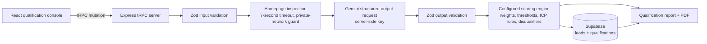

# Architecture

## Trust boundaries

| Boundary | Control |
| --- | --- |
| Browser to API | tRPC input schema rejects invalid or incomplete payloads. |
| Submitted website to server | HTTP/HTTPS only, private-host guard, manual redirects, seven-second timeout, and safe `UNAVAILABLE` fallback. |
| Gemini output to report | JSON MIME response requested and parsed through a strict Zod schema before use. |
| AI language to final score | The server calculates the final score from configured factor weights and applies hard caps independently of the model’s stated score. |
| Server to Supabase | Service-role key remains on the server and is not placed in client code. |

## Qualification factors

The server applies the following explicit weights: service fit 20%, ICP/company fit 15%, budget fit 15%, geographic fit 10%, business-objective fit 10%, SEO use-case fit 10%, timeline fit 5%, buying intent 5%, goal clarity 5%, and information completeness 5%.

The configuration in `server/qualification-config.ts` centralizes the capability profile, target customer assumptions, market preferences, supported currencies, factor weights, thresholds, and hard disqualifiers.
